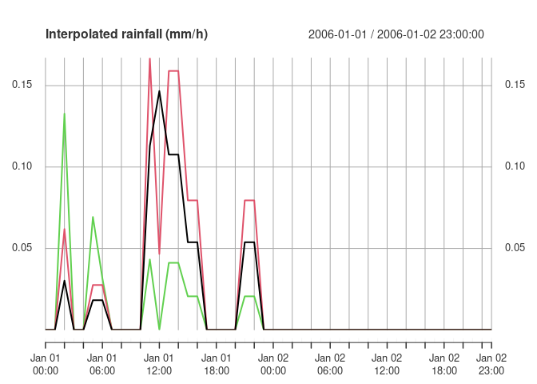

<!-- README.md is generated from README.Rmd. Please edit that file -->

<!--  # efts  -->

# efts

Reading and writing Ensemble Forecast Time Series in netCDF files.
<!-- [](https://travis-ci.org/efts/efts) -->

## Overview

Plain text files are not well suited to storing the large volumes of
data generated for and by ensemble streamflow forecasts with numerical
weather prediction models. netCDF is a binary file format developed
primarily for climate, ocean and meteorological data. netCDF has
traditionally been used to store time slices of gridded data, rather
than complete time series of point data. **efts** is for handling the
latter.

**efts** is designed to handle netCDF data following the [NetCDF for
Water Forecasting Conventions
v2.0](https://github.com/csiro-hydroinformatics/efts/blob/master/docs/netcdf_for_water_forecasting.md)

## Installation

``` r
# From CRAN:
install.packages("efts")

# Or the the development version from GitHub:
# install.packages("devtools")
devtools::install_github("jmp75/efts")
```

## Example use

This is an extract from one of the package vignettes.

``` r
library(efts)
ext_data <- system.file('extdata', package='efts')
rain_file <- file.path(ext_data, 'Upper_Murray_sample_rain.nc')
stopifnot(file.exists(rain_file))

rain_dat <- open_efts(rain_file)
class(rain_dat)
#> [1] "EftsDataSet"
#> attr(,"package")
#> [1] "efts"
```

`rain_dat` has methods to discover and retrieve data in the
file.

``` r
cat(sprintf("This rainfall data set has data for %s stations, the lead time dimension is '%s' because this is not forecast data\n", rain_dat$get_station_count(),
rain_dat$get_lead_time_count()))
#> This rainfall data set has data for 3 stations, the lead time dimension is '1' because this is not forecast data
rain_dat$get_variable_names()
#> [1] "area"          "lat"           "lon"           "rain_der"     
#> [5] "rain_der_qual" "station_id"    "station_name"  "x"            
#> [9] "y"
rain_dat$get_variable_dim_names("rain_der")
#> [1] "station" "time"
```

`rain_der` in this instance has two dimensions, but even if it had been
defined as a 3 or 4 dimension data, or in different orders, the method
`get_all_series` just does the low-level processing to present a
meaninful multivariate `xts` series.

``` r
d <- rain_dat$get_all_series(variable_name = 'rain_der')
head(d)
#> Warning: timezone of object (UTC) is different than current timezone ().
#>                              1          2          3
#> 2006-01-01 00:00:00 0.00000000 0.00000000 0.00000000
#> 2006-01-01 01:00:00 0.00000000 0.00000000 0.00000000
#> 2006-01-01 02:00:00 0.03022585 0.06189353 0.13274320
#> 2006-01-01 03:00:00 0.00000000 0.00000000 0.00000000
#> 2006-01-01 04:00:00 0.00000000 0.00000000 0.00000000
#> 2006-01-01 05:00:00 0.01819110 0.02752321 0.06931218
```

`xts` may insist on warning that the “timezone of object (UTC) is
different than current timezone ().”. This is normal and the series is
exactly as it should be.

``` r
plot(d[1:48], main="Interpolated rainfall (mm/h)")
```

<!-- -->

You should use the `close` method once you are done with accessing the
data set object and its underlying netCDF file.

``` r
rain_dat$close()
```

## Related work

Placeholder section, see whether there is an intersect with:

  - <https://www.r-pkg.org/pkg/ensemblepp>
  - <https://www.r-pkg.org/pkg/tsensembler>
  - <https://www.r-pkg.org/pkg/hyfo>
